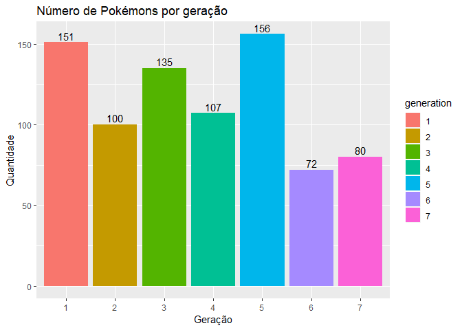
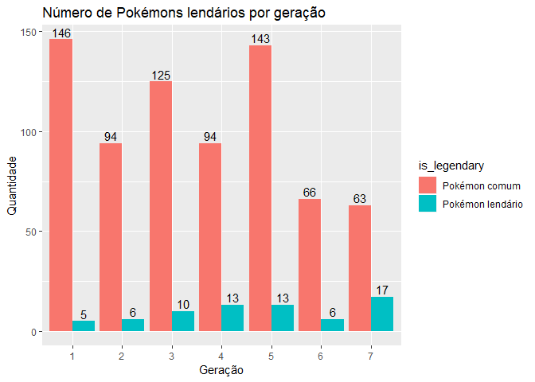
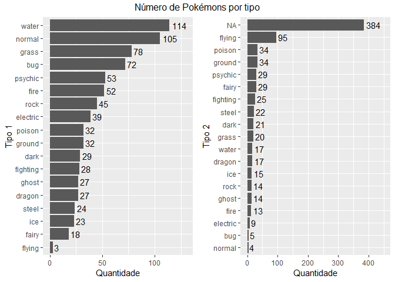
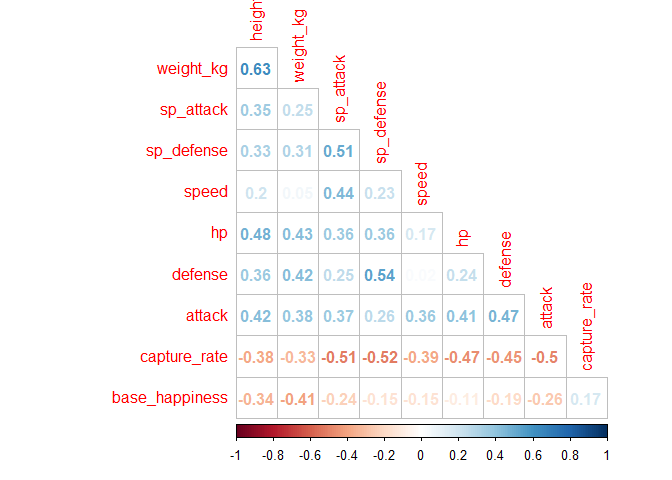
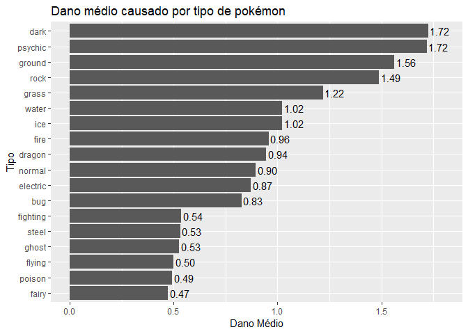

Análise Pokemon
================
Eduardo, Itamar e Rodrigo

### A base

A base de dados utilizada neste trabalho foi obtida através do dataset
do Kaggle [The Complete Pokemon
Dataset](https://www.kaggle.com/rounakbanik/pokemon). Contém informações
de 802 Pokémons de todas as 7 gerações. Os dados descrevem informações
como Estatísticas básicas, performance do pokémon contra outros tipos,
altura, peso, classificação, etc.

O autor do *dataset* propõe diversas análises, dentre elas
apresentaremos:

  - Qual a relação entre altura e peso com as estatísticas básicas do
    Pokémon?
  - Qual é o tipo mais forte e o mais fraco?

Pois bem, vamos começar as análises. O primeiro posso é importar os
dados no R para trabalharmos

``` r
library(tidyverse)

dados <- read_csv("pokemon.csv")
head(dados)
```

    ## # A tibble: 6 x 41
    ##   abilities against_bug against_dark against_dragon against_electric
    ##   <chr>           <dbl>        <dbl>          <dbl>            <dbl>
    ## 1 ['Overgr~        1               1              1              0.5
    ## 2 ['Overgr~        1               1              1              0.5
    ## 3 ['Overgr~        1               1              1              0.5
    ## 4 ['Blaze'~        0.5             1              1              1  
    ## 5 ['Blaze'~        0.5             1              1              1  
    ## 6 ['Blaze'~        0.25            1              1              2  
    ## # ... with 36 more variables: against_fairy <dbl>, against_fight <dbl>,
    ## #   against_fire <dbl>, against_flying <dbl>, against_ghost <dbl>,
    ## #   against_grass <dbl>, against_ground <dbl>, against_ice <dbl>,
    ## #   against_normal <dbl>, against_poison <dbl>, against_psychic <dbl>,
    ## #   against_rock <dbl>, against_steel <dbl>, against_water <dbl>,
    ## #   attack <dbl>, base_egg_steps <dbl>, base_happiness <dbl>,
    ## #   base_total <dbl>, capture_rate <chr>, classfication <chr>,
    ## #   defense <dbl>, experience_growth <dbl>, height_m <dbl>, hp <dbl>,
    ## #   japanese_name <chr>, name <chr>, percentage_male <dbl>,
    ## #   pokedex_number <dbl>, sp_attack <dbl>, sp_defense <dbl>, speed <dbl>,
    ## #   type1 <chr>, type2 <chr>, weight_kg <dbl>, generation <dbl>,
    ## #   is_legendary <dbl>

### Análises prévias

Vamos agora fazer uma análise prévia da base. Abaixo apresenta-se o
número de pokémons por geração:

``` r
dados %>%
  mutate(generation = factor(generation)) %>% 
  ggplot(aes(x = generation, fill = generation)) +
  geom_bar() +
  geom_text(stat = "count",mapping = aes(label=..count..), vjust=-0.3) + 
  labs(title = "Número de Pokémons por geração", x = "Geração", y = "Quantidade")
```

<!-- --> Podemos
observar a primeira \~e clássica\~ geração com seus 151 pokémon e as
gerações 6 e 7 que possuem os menores números de pokémons…

A seguir, apresentamos a proporção de pokémons lendários:

``` r
dados %>%
  mutate(generation = factor(generation),
         is_legendary = ifelse(is_legendary == 1, "Pokémon lendário", "Pokémon comum")) %>% 
  group_by(generation, is_legendary) %>% 
  summarise(qtd = n()) %>% 
  ggplot(aes(x = generation, fill = is_legendary, y = qtd)) +
  geom_bar(stat = "identity", position = position_dodge()) +
  geom_text(aes(label = qtd), vjust=-0.3, position = position_dodge(0.9)) + 
  labs(title = "Número de Pokémons lendários por geração", x = "Geração", y = "Quantidade")
```

<!-- --> Parece que,
quanto menos pokémons se tem, maior a razão de lendários. Quanto mais
recente a geração de pokémons, maior o número de lendários. Nesse ritmo,
a geração 42, vai ter mais pokémon lendário que comum…

Agora vamos verificar o número de pokémons por tipo:

``` r
library(gridExtra)

p1 <- dados %>%
  group_by(type1) %>% 
  summarise(qtd = n()) %>% 
  ggplot(aes(x = reorder(type1, qtd), y = qtd)) +
  geom_bar(stat = "identity") +
  coord_flip() + 
  geom_text(aes(label = qtd), hjust = -0.2) + 
  labs(x = "Tipo 1", y = "Quantidade") +
  ylim(0, 130)

p2 <- dados %>%
  group_by(type2) %>% 
  summarise(qtd = n()) %>% 
  ggplot(aes(x = reorder(type2, qtd), y = qtd)) +
  geom_bar(stat = "identity") +
  coord_flip() + 
  geom_text(aes(label = qtd), hjust = -0.2) + 
  labs(x = "Tipo 2", y = "Quantidade") +
  ylim(0, 450)

grid.arrange(p1, p2, ncol=2, top = "Número de Pokémons por tipo")
```

<!-- -->

Analisando o primeiro tipo de pokémon, vemos que o preominante é água,
seguido por normal, grama e inseto. Os tipos menos comuns são voados,
fada e gelo.

Observando o segundo gráfico (da direita), podemos identificar que 384
pokémon não apresenta um segundo tipo e que o tipo voador é o segundo
tipo com maior frequência.

### Qual a relação entre altura e peso com as estatísticas básicas do pokémon?

Vamos agora responder a primeira pergunta do autor. Para isso, abaixo
apresentamos uma matriz de correlação entre as variáveis selecionadas.

``` r
library(corrplot)

dados %>% 
  mutate(capture_rate = as.numeric(capture_rate)) %>% 
  select(height_m, weight_kg, sp_attack, sp_defense, speed, hp, defense, attack, 
         capture_rate, base_happiness) %>% 
  drop_na() %>% 
  cor() %>% 
  corrplot(method = "number", type = "lower", diag = F)
```

<!-- -->

Podemos observar que a altura é correlacionada com os pontos de vida do
pokémon, bem como o ataque (ambos com coeficiente de correlação acima de
0,4). Já o peso, além dos pontos de vida, correlaciona também com os
pontos de defesa. Olha que legal\! altura determina o poder de ataque,
enquanto o peso determina o poder de defesa. Enquanto o Onix ataca o
Snorlax fica de boa só segurando a onda…

Apesar de não fazer parte do escopo inicial, a matriz de correlaçaõ
trouxe também outras informações interessantes: A chace de capturar um
pokémon é inversamente proporcional às características básicas e ela
aumenta com base na felicidade dele (^^)

### Qual é o tipo mais forte e o mais fraco?

E agora, qual o tipo de pokémon que eu tenho que ter pra bater em todo
mundo? Abaixo apresentamos uma tabela com o dano médio de cada tipo de
pokémon com cada cada um dos tipos apresetados.

``` r
dano_medio <- dados %>% 
  select(type1, against_bug, against_dark, against_dragon, against_electric, against_fairy,
         against_fight, against_fire, against_flying, against_ghost, against_grass, against_ground,
         against_ice, against_normal, against_poison, against_psychic, against_rock, against_steel,
         against_water) %>% 
  group_by(type1) %>% 
  summarise_all(mean) %>% 
  rowwise() %>% 
  mutate(geral = mean(against_bug:against_water)) %>% 
  arrange(-geral)

dano_medio
```

    ## Source: local data frame [18 x 20]
    ## Groups: <by row>
    ## 
    ## # A tibble: 18 x 20
    ##    type1 against_bug against_dark against_dragon against_electric
    ##    <chr>       <dbl>        <dbl>          <dbl>            <dbl>
    ##  1 dark        1.72         0.534          1.10             1.10 
    ##  2 psyc~       1.72         1.94           0.877            1.10 
    ##  3 grou~       1.06         1.08           1.05             0    
    ##  4 rock        0.989        1              0.967            1.04 
    ##  5 grass       1.72         0.968          0.917            0.532
    ##  6 water       1.02         1.02           0.978            1.90 
    ##  7 ice         1.02         1.13           1                1.09 
    ##  8 fire        0.457        0.952          1.01             1.09 
    ##  9 drag~       0.944        1.04           2                0.491
    ## 10 norm~       0.895        1              0.971            1.23 
    ## 11 elec~       0.872        1              0.897            0.538
    ## 12 bug         0.826        0.979          0.938            1.14 
    ## 13 figh~       0.536        0.527          0.982            1.04 
    ## 14 steel       0.531        1.29           0.458            1.02 
    ## 15 ghost       0.528        1.93           1                0.889
    ## 16 flyi~       0.5          1              1.67             1.33 
    ## 17 pois~       0.492        0.922          1.03             1.11 
    ## 18 fairy       0.472        0.5            0                1.11 
    ## # ... with 15 more variables: against_fairy <dbl>, against_fight <dbl>,
    ## #   against_fire <dbl>, against_flying <dbl>, against_ghost <dbl>,
    ## #   against_grass <dbl>, against_ground <dbl>, against_ice <dbl>,
    ## #   against_normal <dbl>, against_poison <dbl>, against_psychic <dbl>,
    ## #   against_rock <dbl>, against_steel <dbl>, against_water <dbl>,
    ## #   geral <dbl>

No gráfico abaixo resumimos tudo no indicador “dano médio causado” por
tipo de pokémon.

``` r
dano_medio %>% 
  select(type1, geral) %>% 
  ggplot(aes(x = reorder(type1, geral), y = geral)) +
  geom_bar(stat = "identity") +
  coord_flip() + 
  geom_text(aes(label = format(geral, digits = 2)), hjust = -0.1) + 
  labs(title = "Dano médio causado por tipo de pokémon", x = "Tipo", y = "Dano Médio") +
  ylim(0, 1.8)
```

<!-- -->

Podemos dotar que o Pokémon tipo Noturno e Psíquico possui o maior dano
médio e o Fada e Veneno são os mais fraquinhos.

Lembrando que na geração 1 não existe nenhum pokémon noturno e que o Mew
e Mewto são psíquicos.

É isso, espero que tenham gostado dessa aventura\!\!\! Até mais\!
